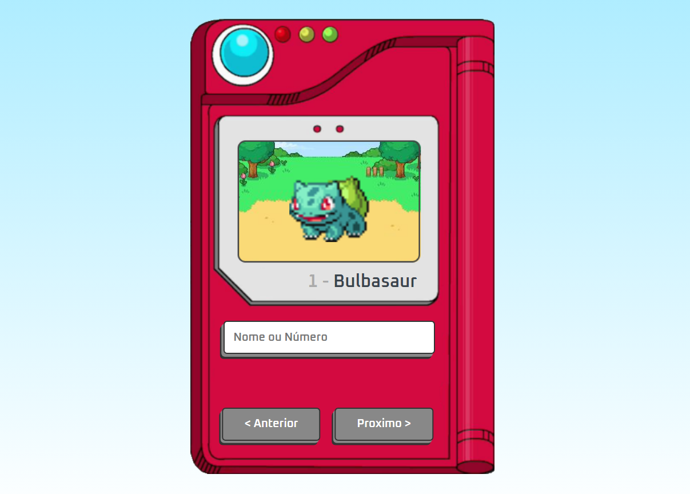

# Pokedex

> Esse projeto foi feito com a finalidade de aprofundar os conhecimentos em frontend, na pokedex é possivel consultar a aparencia do pokemon, informando o nome 
  ou número.

## ☕ Usando <Pokedex>

Para usar <Pokedex>, clique no link abaixo:

https://marqqsdex.netlify.app/

